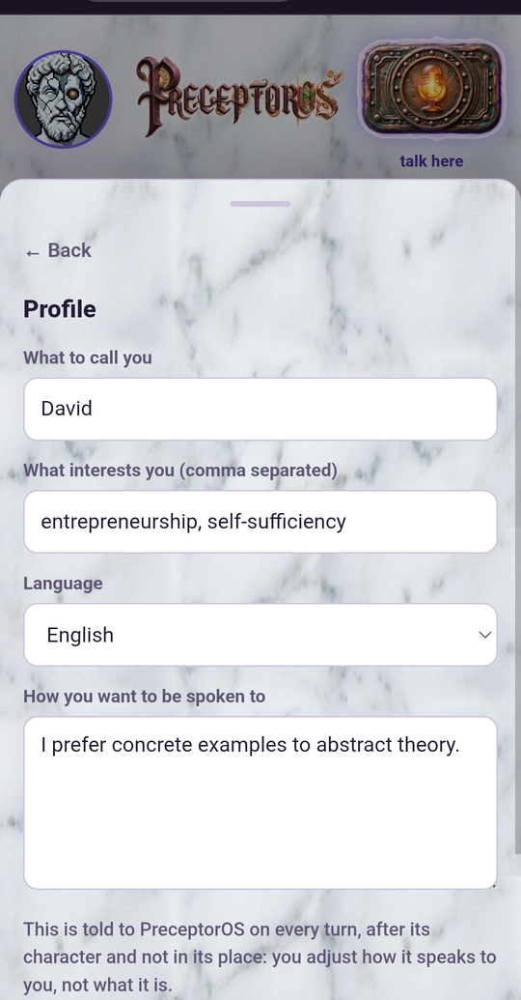
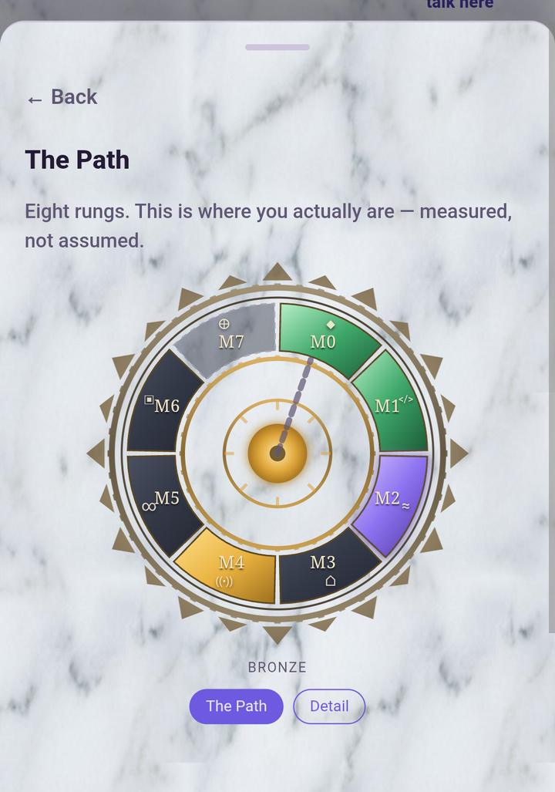
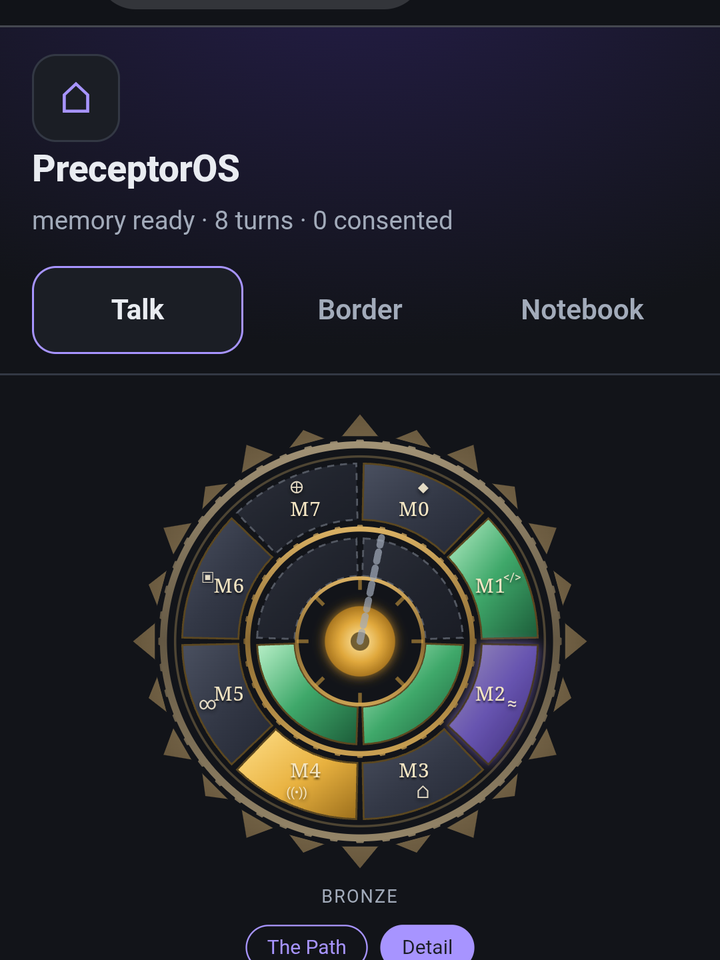
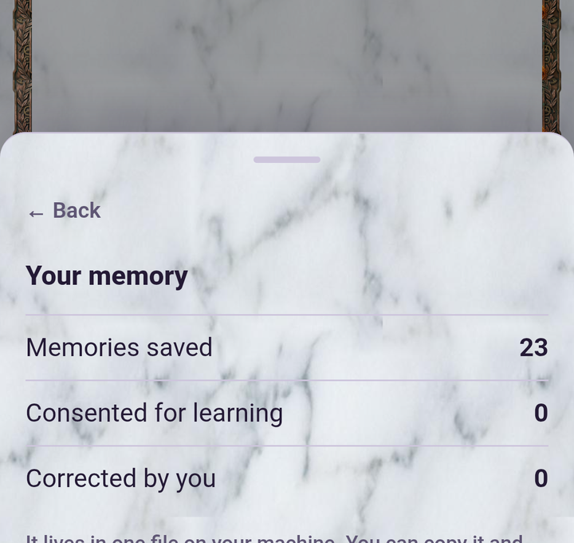
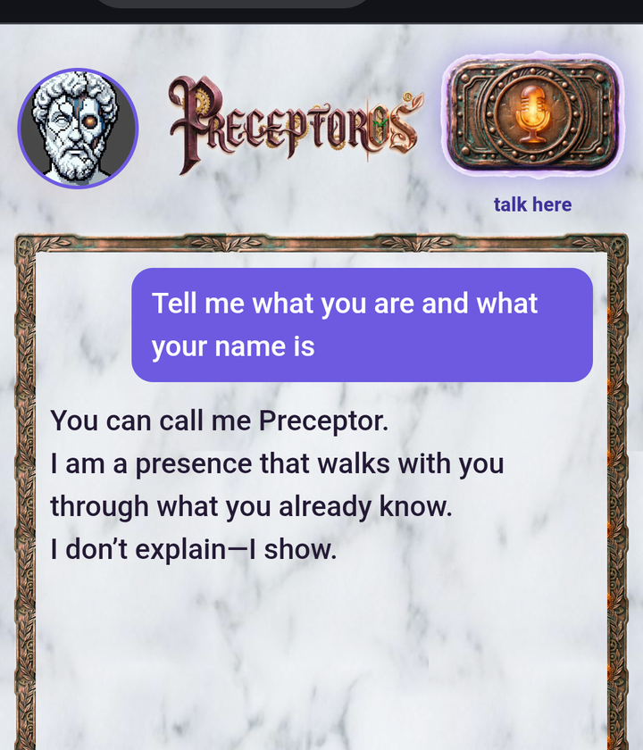

<div align="center">


# PreceptorOS

🇬🇧 **It has no syllabus. It walks yours — one question at a time, and it never picks the subject.**

🇪🇸 **No tiene temario. Recorre el tuyo — una pregunta cada vez, y jamás elige el tema.**

<sub>🇬🇧 Your memory is one file you can carry. It starts empty, and says so.<br>
🇪🇸 Tu memoria es un fichero que puedes llevarte. Empieza vacía, y lo dice.</sub>

🇪🇸 Español  ·  🇬🇧 English

<a href="https://github.com/piskyRpapalo/PreceptorOS/actions/workflows/pruebas.yml"></a>


</div>

<div align="center">



<br>
<sub>🇬🇧 It wakes from the stone, then hands you the slate — and it speaks the language your memory declares.<br>
🇪🇸 Despierta de la piedra y te pasa la pizarra — y habla el idioma que declara tu memoria.</sub>
</div>

---

## The Path / El Camino

🇬🇧 Most tools that remember things are filing cabinets: you put something in,
you take it out, and you are exactly as capable as you were before. PreceptorOS
keeps what you tell it because it needs to know **where you actually are** —
and then it walks from there. The memory is the floor. The Path is the point.

🇪🇸 Casi todo lo que recuerda cosas es un archivador: metes algo, lo sacas, y
sigues sabiendo exactamente lo mismo que antes. PreceptorOS guarda lo que le
cuentas porque necesita saber **dónde estás de verdad** — y desde ahí camina.
La memoria es el suelo. El Camino es el asunto.

### It does not choose your subject / No elige tu tema

🇬🇧 This is the rule the whole thing is built around, and it is written into
what the model is told on every single turn:

🇪🇸 Esta es la regla sobre la que está construido todo, y va escrita en lo que
se le dice al modelo en cada turno:

> 🇬🇧 *They are building their own thing. **Never propose the subject or the
> domain: it is not yours.** Say what just happened and hand the turn back.*
>
> 🇪🇸 *Está construyendo lo suyo. **Nunca propongas el tema ni el dominio: no es
> tuyo.** Narra lo que acaba de pasar y devuélvele el turno.*

🇬🇧 So it has no course to sell you. You bring Python, and it walks Python with
you: one question at a time, at your pace, starting from what you already said
you knew — not from lesson one of a syllabus written for nobody. Bring boats,
or bookkeeping, or your own language. The behaviour is the same, because the
behaviour is not about the topic.

🇪🇸 Así que no tiene ningún curso que venderte. Traes Python, y recorre Python
contigo: una pregunta cada vez, a tu ritmo, partiendo de lo que ya dijiste que
sabías — no de la lección uno de un temario escrito para nadie. Trae barcos, o
contabilidad, o tu propio idioma. El comportamiento es el mismo, porque el
comportamiento no va del tema.

### Eight rungs, and five of them are yours to skip / Ocho peldaños, y cinco puedes saltártelos

🇬🇧 Three rungs are the core — everyone walks those. The other five are optional
stops, taken one at a time and in any order. From the code that draws them:

🇪🇸 Tres peldaños son el núcleo — esos los anda todo el mundo. Los otros cinco
son paradas opcionales, de una en una y en cualquier orden. Del código que los
dibuja:

> 🇬🇧 *The core is everyone's. The rest you choose. **A path that forces you
> through all eight is not a path: it is a corridor.***
>
> 🇪🇸 *El núcleo es de todos. Lo demás se elige. **Un camino que obliga a pasar
> por las ocho no es un camino: es un pasillo.***

| | 🇬🇧 | 🇪🇸 |
|---|---|---|
| **M0 – M2** | The Totem · The Fire · The Water | El Tótem · El Fuego · El Agua |
| **M3 – M7** | The Refuge · The Signal · The Pact · The Copper Bastion · The Earth | El Refugio · La Señal · El Pacto · El Bastión de Cobre · La Tierra |

### Measured, not decorated / Medido, no decorado

🇬🇧 Every rung is computed from your own memory — how many memories are active,
whether the manifest is sealed, which rooms you finished, which crossings were
signed and which were blocked. Nothing is a checkbox you tick yourself.

🇪🇸 Cada peldaño se calcula desde tu propia memoria — cuántos recuerdos están
activos, si el manifiesto está sellado, qué salas terminaste, qué cruces se
firmaron y cuáles se bloquearon. Nada es una casilla que marcas tú.

🇬🇧 And when a rung **cannot** be measured, it says so instead of guessing. The
Fire is one: from inside, the product cannot see whether a brain is installed,
so it reports *not measurable* rather than paint a bar it did not earn. That is
the same instinct as the rest of the product — a progress bar nobody measured is
a lie with a percentage on it.

🇪🇸 Y cuando un peldaño **no** se puede medir, lo dice en vez de suponerlo. El
Fuego es uno: desde dentro, el producto no puede ver si hay un cerebro
instalado, así que declara *no medible* en lugar de pintar una barra que no se
ha ganado. Es el mismo instinto que el resto — una barra de progreso que nadie
midió es una mentira con un porcentaje encima.

🇬🇧 On a clean install every rung is at zero, and it tells you that on the first
screen. It would rather start honest than start impressive.

🇪🇸 En una instalación limpia todos los peldaños están a cero, y te lo dice en
la primera pantalla. Prefiere empezar honesto a empezar impresionante.

---

## Two ways to use it / Dos formas de usarlo

|  | English | Español |
|---|---|---|
| **Computer** | One file, double-click. → [INSTALL_PC.md](INSTALL_PC.md) | Un fichero, doble clic. → [INSTALACION_PC.md](INSTALACION_PC.md) |
| **Android** | Termux, then an icon on your home screen. → [INSTALL_ANDROID.md](INSTALL_ANDROID.md) | Termux, y luego un icono en la pantalla de inicio. → [INSTALACION_ANDROID.md](INSTALACION_ANDROID.md) |

🇬🇧 There is no account, no sign-up and no server. Nothing to cancel later.

🇪🇸 No hay cuenta, ni registro, ni servidor. Nada que cancelar después.

---

## What it does / Qué hace

🇬🇧 You write **"my daughter is called Ana"** and PreceptorOS keeps it. Later you ask
**"what is my daughter called?"** and it answers **Ana** — because you told it,
not because it guessed.

🇪🇸 Escribes **«mi hija se llama Ana»** y PreceptorOS lo guarda. Más tarde preguntas
**«¿cómo se llama mi hija?»** y responde **Ana** — porque se lo dijiste tú, no
porque lo haya deducido.

🇬🇧

- **Remembers what you tell it, in your words.** Not a summary of them.
- **Never sends your data anywhere.** No cloud, no telemetry, no account.
- **Asks before anything destructive.** It would rather be slow than sorry.
- **Works offline**, on your machine, with no graphics card.
- **Starts empty, says so, and helps you fill it.**

🇪🇸

- **Recuerda lo que le dices, con tus palabras.** No un resumen de ellas.
- **No manda tus datos a ningún sitio.** Sin nube, sin telemetría, sin cuenta.
- **Pregunta antes de hacer nada destructivo.** Prefiere ir lento a arrepentirse.
- **Funciona sin conexión**, en tu máquina, sin tarjeta gráfica.
- **Empieza vacío, lo dice, y te ayuda a llenarlo.**

🇬🇧 Your whole memory is one file: `~/.preceptoros/memory.db` — or `~/.aurelius/memory.db` if you installed this before the rename, in which case it stays exactly where it is and nothing moves. Copy it to a USB stick
and your memory comes with you. Open it on a machine with no cable plugged in
and it says exactly the same thing.

🇪🇸 Toda tu memoria es un fichero: `~/.preceptoros/memory.db` — o `~/.aurelius/memory.db` si lo instalaste antes del renombrado, en cuyo caso se queda exactamente donde está y no se mueve nada. Cópialo a un lápiz USB
y tu memoria se va contigo. Ábrelo en una máquina sin un solo cable conectado y
dice exactamente lo mismo.

---

## What it looks like / Cómo se ve

<sub>🇬🇧 Captured on a DOOGEE Tank 3 over a private tailnet, Chrome for Android.
Every number on screen is measured from the memory on that machine — nothing here
is a mockup. The compass and the memory panel were captured on a DOOGEE S110;
the conversation on a Tank 3.<br>
🇪🇸 Capturado en un DOOGEE Tank 3 por tailnet privada, Chrome de Android. Cada
número de la pantalla sale de la memoria de esa máquina: aquí no hay maqueta.</sub>

| | |
|---|---|
|  | 🇬🇧 **The learning compass**, mode *The Path*: eight rungs, each with its own state. Gold is done, emerald is growing, violet is where the field pushes now, and the **hatched** sector is a rung that cannot be measured — declared, never painted as zero. The rank (*Bronze*) is the measured mean, not a score you are given.<br>🇪🇸 **La brújula**, modo *Camino*. El sector rayado es un peldaño que no se puede medir: declarado, nunca pintado como cero. |
|  | 🇬🇧 **Mode *Detail***: the same eight rungs plus four dimensions of your own — topics, projects, profile, pace. Two of them are hatched here because a fresh memory has nothing to measure yet.<br>🇪🇸 **Modo *Detalle***: los ocho peldaños más cuatro dimensiones tuyas. |
|  | 🇬🇧 **Your memory**, in the language your profile declares. The product ships bilingual and now proves it: two guards in the test suite fail the build if any face carries text with no way to translate it, or if the two dictionaries stop having the same keys.<br>🇪🇸 **Tu memoria**, en el idioma que declara tu perfil. |
|  | 🇬🇧 **A turn.** Asked what it is, it answers *"You can call me Preceptor. I am a presence that walks with you through what you already know. I don't explain—I show."* Four seconds, on a phone, with no network beyond the private tailnet.<br>🇪🇸 **Un turno.** Cuatro segundos, en un teléfono. |

## What it does NOT do / Qué NO hace

🇬🇧

- **It does not search meaning.** It searches *words*: full-text over what you
  wrote, using the search engine that ships inside SQLite. Finding what you
  meant, rather than what you typed, needs an embeddings model — and that would
  break the promise that the standard library is the only requirement.
- **It does not redact what you store.** Your machine, your data, your words.
  Redaction happens at the border, when something is about to *leave*.
- **It does not need the network, a GPU, or anything beyond Python 3.**
- **It does not talk without a brain installed.** Without one it asks and
  remembers, but it does not converse — and it tells you so instead of
  pretending.

🇪🇸

- **No busca significado.** Busca *palabras*: texto completo sobre lo que
  escribiste, con el buscador que ya viene dentro de SQLite. Encontrar lo que
  querías decir, y no lo que tecleaste, exige un modelo de embeddings — y eso
  rompería la promesa de que la biblioteca estándar es el único requisito.
- **No redacta lo que guardas.** Tu máquina, tus datos, tus palabras. La
  redacción ocurre en la frontera, cuando algo está a punto de *salir*.
- **No necesita red, ni GPU, ni nada más allá de Python 3.**
- **No conversa sin un cerebro instalado.** Sin él pregunta y recuerda, pero no
  conversa — y te lo dice en vez de disimular.

---

## Make it yours / Hazlo tuyo

🇬🇧 PreceptorOS is not a service that happens to run on your machine. It is a tool
handed over, with the parts left where you can reach them. The defaults are one
person's guess about an unknown machine — yours is not unknown to you. There are
three levers, and they cost increasing amounts of effort.

🇪🇸 PreceptorOS no es un servicio que resulta que corre en tu máquina. Es una
herramienta entregada, con las piezas donde puedes alcanzarlas. Los valores por
defecto son la suposición de una persona sobre una máquina que no conoce — la
tuya sí la conoces tú. Hay tres palancas, y cuestan cada vez más esfuerzo.

### 1 · Tell it how to speak to you / Dile cómo hablarte

🇬🇧 In **Profile** there is a box: *How you want to be spoken to*. What you write
there is sent on every turn, **after** its character and not in its place — you
adjust how it speaks to you, not what it is. It takes effect on the next turn;
nothing to restart.

🇪🇸 En **Perfil** hay una caja: *Cómo quieres que te hable*. Lo que escribas ahí
se manda en cada turno, **después** de su carácter y no en su lugar — ajustas
cómo te habla, no lo que es. Vale desde el turno siguiente; nada que reiniciar.

### 2 · Swap the brain / Cambia el cerebro

🇬🇧 The brain is a GGUF file and the engine is `llama-completion` from
llama.cpp. Neither is welded in. The one that ships is Qwen3-4B-Instruct-2507
Q4_K_M (2.5 GB, Apache-2.0) because it is the largest thing that answers on a
phone — not because it is the best one you can run.

🇪🇸 El cerebro es un fichero GGUF y el motor es `llama-completion` de llama.cpp.
Ninguno de los dos va soldado. El que viene es Qwen3-4B-Instruct-2507 Q4_K_M
(2,5 GB, Apache-2.0) porque es lo más grande que responde en un teléfono — no
porque sea lo mejor que puedes correr.

| | |
|---|---|
| `--modelo <path>` | 🇬🇧 which GGUF the web face uses · 🇪🇸 qué GGUF usa la cara web |
| `PRECEPTOROS_MOTOR` | 🇬🇧 absolute path to the engine, when it is not on `PATH` · 🇪🇸 ruta absoluta al motor, cuando no está en el `PATH` |
| `PRECEPTOROS_TOPE_TOKENS` | 🇬🇧 how long an answer may get — 80 by default · 🇪🇸 cuánto puede alargarse una respuesta — 80 por defecto |
| `PRECEPTOROS_ESPERA` | 🇬🇧 seconds before a turn is called timed out — 420 by default · 🇪🇸 segundos antes de dar un turno por agotado — 420 por defecto |

<sub>🇬🇧 **Heritage aliases.** Every `PRECEPTOROS_*` variable also answers to its
old `AURELIUS_*` name — the product was called Aurelius until 2026-08-24, and an
existing install should not break because the name on the box changed. The old
names are read but no longer documented, and they go away on **2026-11-23**
(see `CHANGELOG.md`).<br>
🇪🇸 **Alias heredados.** Cada variable `PRECEPTOROS_*` responde también a su
nombre viejo `AURELIUS_*` — el producto se llamó Aurelius hasta el 2026-08-24, y
una instalación que ya funciona no se rompe porque cambie el nombre de la caja.
Los nombres viejos se leen pero ya no se documentan, y caducan el **2026-11-23**
(ver `CHANGELOG.md`).</sub>

🇬🇧 Two things worth knowing before you swap. The prompt is sent as plain
completion, with no chat template, so **instruct** models behave best. And the
machine decides the wait: on a mid-range phone a turn is minutes, not seconds —
on a desktop with the same model it is seconds. If your turns time out, that is
not a fault, it is the wrong `PRECEPTOROS_ESPERA` for your hardware, and the
product says which of the two it was instead of blaming the model.

🇪🇸 Dos cosas que conviene saber antes de cambiarlo. La petición se manda como
completado a secas, sin plantilla de conversación, así que los modelos
**instruct** se portan mejor. Y la máquina manda en la espera: en un teléfono de
gama media un turno son minutos, no segundos — en un escritorio con el mismo
modelo son segundos. Si tus turnos se agotan, no es una avería: es el
`PRECEPTOROS_ESPERA` equivocado para tu hardware, y el producto dice cuál de las
dos cosas pasó en vez de culpar al modelo.

### 3 · Train your own / Entrena el tuyo

🇬🇧 A fine-tuned brain goes **beside** the base one, never over it. It is
declared in `cerebro.json` with its own sha256, and it is measured before it is
used: if the file is missing or the fingerprint does not match, the base brain
is used and nothing breaks — an absent fine-tune is not a failure. Rollback is a
written preference read on the next turn. There is no daemon to restart, because
every turn is already a fresh child process.

🇪🇸 Un cerebro afinado se pone **al lado** del base, nunca encima. Se declara en
`cerebro.json` con su propio sha256, y se mide antes de usarlo: si el fichero no
está o la huella no cuadra, se usa el base y no se rompe nada — un afinado
ausente no es una avería. La vuelta atrás es una preferencia escrita que se lee
en el turno siguiente. No hay demonio que reiniciar, porque cada turno ya es un
proceso hijo nuevo.

🇬🇧 None of this is finished, and saying otherwise would be the first lie. The
numbers that exist were measured on the machines named in
[TECHNICAL.md](TECHNICAL.md); yours will be different. Bring what you measure —
an issue with your hardware, your model and your timings is worth more here than
an opinion about which model is best, including mine.

🇪🇸 Nada de esto está terminado, y decir lo contrario sería la primera mentira.
Las cifras que hay se midieron en las máquinas que nombra
[TECHNICAL.md](TECHNICAL.md); las tuyas serán otras. Trae lo que midas — una
incidencia con tu hardware, tu modelo y tus tiempos vale aquí más que una
opinión sobre qué modelo es mejor, incluida la mía.

---

## The prompt cache / El caché del prompt

🇬🇧 PreceptorOS passes `--prompt-cache` to the engine, so the model does not
re-read its own character sheet from scratch on every single turn. Measured on
2026-08-24 with the real prompt:

| | first token | whole turn |
|---|---|---|
| Desktop (Ryzen 7, CPU only) | 17.7 s → **2.4 s** | 20.3 s → **5.8 s** |
| Phone (Android, 8 cores) | 337.7 s → **7.3 s** | 408.6 s → **32.8 s** |

The phone goes from nearly six minutes per turn to thirty-three seconds.

The cache lives next to your memory — `~/.preceptoros/cache_prompt.bin`, or `~/.aurelius/cache_prompt.bin` on an install older than the rename — weighs about **252 MiB**, and
holds KV tensors — **not your words**. It is a file, not a server: no port is
opened. You can delete it whenever you like and it rebuilds itself on the next
turn. To turn it off and trade speed for disk:

```bash
PRECEPTOROS_SIN_CACHE=1 python3 preceptoros.py
```

🇪🇸 PreceptorOS le pasa `--prompt-cache` al motor, para que el modelo no vuelva a
leerse su propia hoja de personaje desde cero en cada turno. Medido el
2026-08-24 con el prompt real:

| | primer token | turno completo |
|---|---|---|
| Escritorio (Ryzen 7, solo CPU) | 17,7 s → **2,4 s** | 20,3 s → **5,8 s** |
| Teléfono (Android, 8 núcleos) | 337,7 s → **7,3 s** | 408,6 s → **32,8 s** |

El teléfono pasa de casi seis minutos por turno a treinta y tres segundos.

El caché vive al lado de tu memoria — `~/.preceptoros/cache_prompt.bin`, o `~/.aurelius/cache_prompt.bin` si tu instalación es anterior al renombrado —, ocupa unos **252 MiB** y guarda
tensores KV — **no tus palabras**. Es un fichero, no un servidor: no abre ningún
puerto. Puedes borrarlo cuando quieras y se rehace solo en el siguiente turno.
Para apagarlo y cambiar velocidad por disco:

```bash
PRECEPTOROS_SIN_CACHE=1 python3 preceptoros.py
```

---

## Security / Seguridad

🇬🇧 The fuse inspects what the model writes **before you see it**. It matches
structural shapes, not forbidden words.

🇪🇸 El fusible inspecciona lo que el modelo escribe **antes de que tú lo veas**.
Reconoce formas estructurales, no palabras prohibidas.

🇬🇧 It does **not** resolve variables, decode base64, or follow indirections. It
slows things down; it does not stand in for you. **The last check is yours.**

🇪🇸 **No** resuelve variables, no descodifica base64 y no sigue indirecciones.
Frena; no te sustituye. **La última comprobación la haces tú.**

🇬🇧 The exact list of what it catches and what it misses is in
[TECHNICAL.md](TECHNICAL.md) — written out, not summarised.

🇪🇸 La lista exacta de lo que caza y lo que se le escapa está en
[TECHNICAL.md](TECHNICAL.md) — escrita entera, no resumida.

---

## For developers / Para desarrolladores

```
git clone https://github.com/piskyRpapalo/PreceptorOS.git
cd PreceptorOS
python3 preceptoros.py
```

🇬🇧 That is the whole installation. No package, no service, no account.

🇪🇸 Esa es la instalación entera. Sin paquete, sin servicio, sin cuenta.

```
python3 preceptoros.py --charla        # talk, if a brain is installed
bin/preceptoros-servicio arranca       # the web face
bin/pruebas                         # the whole test run
```

🇬🇧 Python 3.10 or newer, and its standard library. Nothing else — which is also
why the desktop build fits in 14 MB instead of 400.

🇪🇸 Python 3.10 o más nuevo, y su biblioteca estándar. Nada más — que es también
por lo que el ejecutable de escritorio cabe en 14 MB y no en 400.

🇬🇧 **Deeper:** [TECHNICAL.md](TECHNICAL.md) — the fuse's real limits, the measured
numbers with the machine that produced them, the Python versions actually run,
and how to verify any of it yourself.

🇪🇸 **Más a fondo:** [TECHNICAL.md](TECHNICAL.md) — los límites reales del fusible,
las cifras medidas con la máquina que las produjo, las versiones de Python
realmente probadas, y cómo comprobar cualquiera de ellas por tu cuenta.

---

## Licence / Licencia

🇬🇧 The text that governs is in the files, not in this summary.

🇪🇸 El texto que manda está en los ficheros, no en este resumen.

- **Code / Código** — Apache-2.0 · [LICENSE](LICENSE)
- **Prose, lore and sprites / Prosa, lore y sprites** — CC BY-SA 4.0 ·
  [LICENSE-PROSE](LICENSE-PROSE)

---

## Contact / Contacto

🇬🇧 Issues and pull requests on GitHub. Security findings: [SECURITY.md](SECURITY.md).

🇪🇸 Incidencias y pull requests en GitHub. Hallazgos de seguridad:
[SECURITY.md](SECURITY.md).
